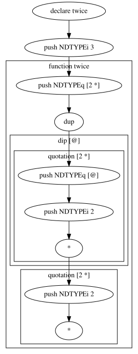

# 9.

[](https://github.com/sanyappc/9./actions/workflows/ci.yml)

**9.** is a tiny pure concatenative (stack-based) language in the spirit of
Joy and Cat, with an interpreter written in Haskell. Every function takes the
stack and returns it changed. Errors are values too.

It comes with a REPL and a step-by-step execution graph that shows which
function put each value on the stack.

*[По-русски ниже.](#по-русски)*

```
> .twice dup [@] dip @ #
stack: []
> 3 [2 *] @twice
stack: [NDTYPEi 12]
> pop .fact dup 0 > then dup 1 - @fact * else pop 1 endif #
stack: []
> 5 @fact
stack: [NDTYPEi 120]
> pop "new" " wave" 9.
stack: [NDTYPEs "new wave"]
```

`twice` takes a quotation and runs it two times: `dup` copies it, `[@] dip`
runs the lower copy, then `@` runs the upper one.

## Build and run

With [GHCup](https://www.haskell.org/ghcup/) (GHC + cabal) installed:

```sh
cabal run ninedot                                   # REPL
cabal run ninedot-graph -- examples/quotations.9 | dot -Tsvg > graph.svg
tests/run.sh "$(cabal list-bin ninedot)"            # golden tests
```

The old `make` build works too: `make cons` and `make graph` put the
binaries into `bin/`.

In the REPL, `l file.9 other.9` loads files, a line ending with `\` continues
on the next one, and `q` quits. If a line fails, the stack is rolled back.

## The language

| Syntax | Meaning |
|---|---|
| `42` `-1.5` `'c'` `"str"` `True` | push a value |
| `pop` `dup` `swap` `dswap` | stack shuffling (`dswap`: swap top two pairs) |
| `rotr` / `->`, `rotl` / `<-` | rotate the whole stack |
| `+ - * / div mod` | arithmetic (`+` also joins strings) |
| `== <> < > <= >=` | comparison |
| `&& \|\| xor ~` | logic (`~` also negates numbers) |
| `9.` | concatenate two strings, chars or quotations |
| `cond then ... else ... endif` | conditional (`else` is optional) |
| `.name ... #` | define a function |
| `@name` | call a function |
| `%name` | push a function reference |
| `[ ... ]` | quotation: a program pushed as a value |
| `@` | run the quotation or function reference on top |
| `x [q] dip` | run `q` under `x` |
| `exit` | leave the current function or quotation |

## Execution graph

`ninedot-graph` writes the execution as a Graphviz graph. Functions, if
branches and quotations are drawn as clusters. This is `docs/twice.9`:



There is also a GTK stepper (`gtk.hs`) and a CGI web version (`cgi.hs`).
They are built with `cabal build -f gui` / `-f cgi`, but their libraries
(gtk2hs with glade, cgi) are old, so they may not build today.

## Project layout

| Path | What is inside |
|---|---|
| `modules/NDType.hs` | values and actions (the AST) |
| `modules/NDParse.hs` | Parsec parser |
| `modules/NDActionHandlers.hs` | primitive operations on the stack |
| `modules/Runtime.hs` | the interpreter |
| `modules/NDGraph.hs` | the interpreter that also builds the graph |
| `main.hs`, `graph.hs`, `gtk.hs`, `cgi.hs` | REPL, graph tool, GUI, web version |
| `examples/`, `tests/` | example programs, golden tests |

## History

A university lab from winter 2012–2013 by dvdalex (sanyappc),
Drogunov Igor and ldinc. It was brought back to life in 2026 with
quotations, `dip`, a working `exit`, a haskeline REPL, cabal and CI.

---

## По-русски

**9.** — маленький чистый конкатенативный (стековый) язык в духе Joy и Cat.
Интерпретатор написан на Haskell. Каждая функция принимает стек и возвращает
его изменённым, ошибки тоже лежат на стеке как значения. Есть REPL и граф
пошагового выполнения, где видно, какая функция положила каждое значение.

Сборка: `cabal run ninedot` (REPL) или `make cons`. Синтаксис описан в
таблице выше. Главное:
- `[ ... ]` — цитата, то есть программа как значение; `@` её выполняет;
- `x [q] dip` выполняет `q` под `x`;
- `9.` склеивает строки или цитаты;
- `exit` выходит из функции или цитаты, в том числе из `then`/`else`.

### Исходное задание (2012)

	Создать полный по Тьюрингу чистый язык (рабочее название "9."),
	функции которого работают со стеком (принимают стек и возвращают
	оний измененный) и написать ядро-интерпретатор на языке Haskell
	(без использования монад, за исключением, может быть, монады Maybe).
	Языки, которые планируемо окажут влияние:
		1. joy (функциональность)
		2. cat (набор функций)
		3. spoon, brainfuck (минималистичность)
	NB:
		- реализовать контроль типов (стек общий)
		- на ранних стадиях не уделять внимание обработке исключений
